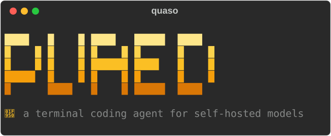

<p align="center">
  
</p>

<p align="center">
  <a href="https://github.com/jacenkow/quaso/actions/workflows/ci.yml"></a>
  <a href="https://www.python.org/downloads/"></a>
  <a href="LICENSE"></a>
</p>

A coding agent for your terminal, running against your own
[Ollama](https://ollama.com) server. Tool-calling loop, file editing,
shell, web search, context management, permissions. No API keys, no
accounts, no telemetry.

```
❯ Which Python versions does this project support? Check pyproject.toml.

● read_file(pyproject.toml)
  ⎿      1      [build-system]
         2      requires = ["hatchling"]
         3      build-backend = "hatchling.build"
    … +76 lines
This project requires Python 3.11 or higher (and lists classifiers for
3.11, 3.12, and 3.13).
```

## The honest bit

This is a learning project. More mature agents exist and will serve you
better today. quaso is here because building one teaches you far more
about why agents fail than reading about it does.

It works, and I use it daily, but it is version 0.x for a reason:
interfaces change without warning. Tested against `qwen3.6` and `gemma4`;
any model reporting the `tools` capability should work, though small
models struggle with multi-step tasks and no harness fixes that.

Pull requests would genuinely make my day. [CONTRIBUTING.md](CONTRIBUTING.md)
says how, and it is short.

## Getting started

You need an Ollama server with a tool-capable model. Then pick one:

**Nix**, nothing installed:

```bash
nix run github:jacenkow/quaso
```

**A script**, which uses `uv` or `pipx` if you have them and a private
virtualenv under `~/.local` otherwise:

```bash
curl -fsSL https://raw.githubusercontent.com/jacenkow/quaso/main/install.sh | sh
```

Piping a script into a shell is worth being suspicious of. Read it
first if you like: it is [one file](install.sh), and `sh install.sh`
works just as well once downloaded.

**By hand**, needing Python 3.11+:

```bash
git clone git@github.com:jacenkow/quaso.git && cd quaso
python3 -m venv .venv
.venv/bin/pip install -e ".[dev]"
source .venv/bin/activate       # or activate.csh / activate.fish
quaso
```

However you got here, the first run asks where your server is, lists
the models that can call tools, and writes `.quaso/config.toml`. After
that, `quaso` just starts. Web search needs no signup and nothing
hosted.

A dev shell with the test tools and the Linux sandbox is
`nix develop github:jacenkow/quaso`.

## Using it

Start `quaso` in a project directory and talk to it. Ctrl-C interrupts a
turn without losing the session; Ctrl-D exits.

```bash
quaso -p "fix the failing test"   # one-shot; non-zero exit if it fails
quaso --continue                 # resume the last session
```

Type `/` to list commands:

| Command | |
|---|---|
| `/new` | fresh session |
| `/compact` | summarise history to reclaim context |
| `/context` | token usage |
| `/tools`, `/mcp`, `/sessions` | what's available |
| `/model [name]` | switch model, unloading the old one from VRAM |
| `/help`, `/quit` | |

Fourteen built-in tools:

| | |
|---|---|
| `read_file` `write_file` `edit_file` `list_dir` `glob` `grep` | files |
| `bash` | shell |
| `web_search` `fetch_url` | internet |
| `todo_write` | a plan, which measurably keeps smaller models on track |
| `task` | a subagent with its own context window |
| `compact` | the model summarising what it no longer needs |
| `skill` | instructions loaded on demand, below |
| `ask` | a question put to you mid-turn, so ambiguity is settled first |

Independent calls in one turn run together, which matters most when the
model fires off several searches or fetches at once.

### Skills

A markdown file with a name and a description, in `.quaso/skills/` for a
project or `~/.config/quaso/skills/` for yourself.

```markdown
---
name: adding-a-tool
description: Add a tool to quaso, including the easily missed steps
models: qwen3, gemma4
---
```

Only descriptions go in the prompt; the model calls `skill` to read the
one it wants. Eight skills cost roughly 180 tokens that way against about
3,000 inlined.

`models` is optional and matches on prefix, so you can write for one
family without spending context on the others. Files beside `SKILL.md`
are listed, not inlined, so a skill can carry a template read only when
needed.

### Permissions

Inside the directory you started in, reads run freely and anything that
writes or runs commands asks first. Anything reaching *outside* asks too,
even a plain read: reading a file and sending it somewhere are otherwise
both silent.

`--mode acceptEdits` allows in-project edits, `readonly` refuses all
mutations, `yolo` asks nothing *inside the working directory*. Leaving
it is still a question, in every mode: a read outside is the one thing
the sandbox cannot cover, because the file tools run inside quaso rather
than as a child process.

```toml
[permissions]
allow = ["bash(git status*)", "bash(pytest -q)"]
deny = ["write_file(*.env)"]
```

Command-scoped `bash` rules cover simple commands only. Pipes, redirects,
substitutions and chaining always ask. Use `deny = ["bash"]` to disable
the shell reliably; command patterns are not a sandbox.

Shell commands run confined where the platform allows: Seatbelt on
macOS, bubblewrap on Linux when installed. Writes are limited to the
working directory and temp, credential paths are unreadable, and it
applies to whatever the command spawns. The banner says what is in force.

```toml
[sandbox]
mode = "auto"       # auto | off
network = true      # false denies the network to shell commands
```

> [!WARNING]
> The sandbox covers `bash` only. The file tools run inside quaso itself,
> so nothing but the workspace boundary stands between them and the rest
> of your disk. That boundary holds in every mode, `yolo` included, but
> it is a prompt rather than a kernel, and a prompt answered carelessly
> is no boundary at all.

## Configuration

Layered TOML: defaults, then `~/.config/quaso/config.toml`, then
`./.quaso/config.toml`, then CLI flags. `${VAR}` and `${VAR:-fallback}`
expand as in a shell, so addresses and keys can live in your environment.

```toml
[provider]
base_url = "${OLLAMA_HOST:-http://localhost:11434}"
model = "qwen3.6:latest"

[provider.options]      # passed to Ollama as-is
think = true
num_ctx = 32768
```

Every option is documented in
[.quaso/config.example.toml](.quaso/config.example.toml). An `AGENTS.md`
in the project root is appended to the system prompt, so a repository
already carrying instructions for another agent works unchanged.

Search walks a chain of keyless engines (DuckDuckGo, its lite endpoint,
the Stack Exchange API, Wikipedia) until one answers, so one rate limit
does not take search down. SearXNG, Tavily and Brave slot in if you have
them. Fetched pages are marked untrusted in the prompt, bounded in size,
and private addresses are refused unless you opt in.

## Licence

[MIT](LICENSE).
